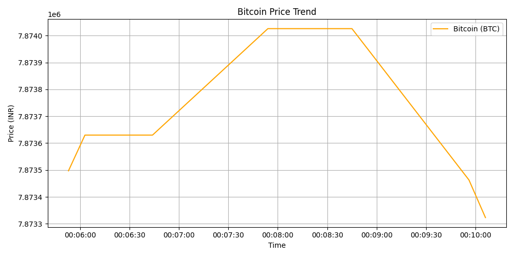

# 🤖 Crypto Orchestrator (V2)

## 🚀 Overview
An automated data engineering workflow that orchestrates the extraction of cryptocurrency price data on a strict schedule. Built to handle API instability and rate limits gracefully.

## 🛠️ Tech Stack
* **Orchestration:** Apache Airflow
* **Language:** Python
* **Database:** SQLite / PostgreSQL
* **API:** CoinGecko REST API

## 🔧 Engineering Challenges Solved
* **Rate Limiting:** Implemented **Exponential Backoff** algorithms to handle API 429 errors automatically.
* **Dependency Management:** Airflow DAGs ensure data is cleaned *before* being loaded into the database.
* **Alerting:** Configured task failure callbacks to notify on pipeline breakage.
